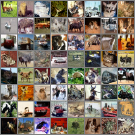

# Denoising Diffusion Probabilistic Models

PyTorch Re-Implementation of Denoising Diffusion Probabilistic Models

train_vae.py is used for vae-denoising task as a baseline compared to ddpm.

- Datasets
    - CIFAR10 https://www.cs.toronto.edu/~kriz/cifar.html
    - Mnist   https://yann.lecun.com/exdb/mnist/
    - CelebA  https://mmlab.ie.cuhk.edu.hk/projects/CelebA.html
   
## Requirements
 ``` 
pip install -r requirements.txt
 ```
## Training
- Take CelebA for example:
    ``` 
   python train.py --dataset CelebA 
    ```
- Overwrite arguments
    ```
  python train.py --dataset CelebA --epochs 50 --channels 3 --sample_epoch 5
    
     ```


## FID Evaluate 
make sure install package pytorch-fid first
 ```
!pip install pytorch-fid
 ```

 ```
python fid.py /real/image/dir /generated/image/dir 
 ```
[Optional] Overwrite argument
```
  --sample_epoch 1 --epoch 10 --batch_size 20
 ```


Reference：

- Denoising Diffusion Probabilistic Models](https://arxiv.org/abs/2006.11239)
- Official TensorFlow implementation](https://github.com/hojonathanho/diffusion)
- Denoising Diffusion Probabilistic Models (DDPM) | https://nn.labml.ai/diffusion/ddpm/index.html
- labmlai | https://github.com/labmlai/annotated_deep_learning_paper_implementations
- CelebA Dataset | https://mmlab.ie.cuhk.edu.hk/projects/CelebA.html
- U-Net model for Denoising Diffusion Probabilistic Models (DDPM) | https://nn.labml.ai/diffusion/ddpm/unet.html

  ## Todo

 
-Eval "fake image" step 51000/800000 (unfinished training)

